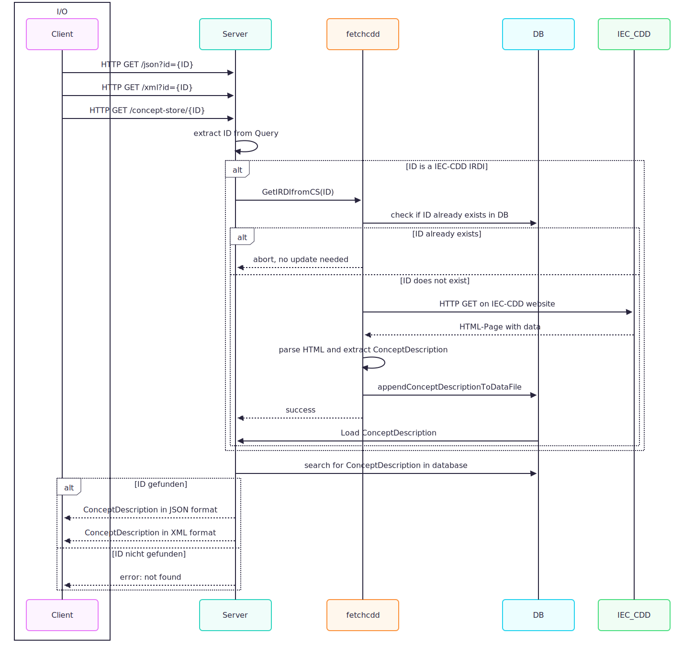

# concept store

## Description

This project is a small **HTTP server written in Go** that loads **ConceptDescriptions** (based on the [Asset Administration Shell (AAS) Standard 3.0](https://industrialdigitaltwin.org)) from a local JSON file, stores them in memory, and serves them through a simple REST API in **JSON** or **XML** format.  
Additionally, it can dynamically fetch ConceptDescriptions from the external **CDD (Common Data Dictionary)** source.

---

## Features

- Loads ConceptDescriptions from a JSON file at startup  
- Provides REST endpoints for JSON and XML output  
- Can dynamically fetch ConceptDescriptions from IEC-CDD source 
- Automatically reloads the local data file after a successful CDD fetch  
- Built-in health check endpoint  
- Graceful shutdown on interrupt (`Ctrl+C`)

---

## Project Structure

```bash
.
├── main.go               # Main server implementation
├── fetchcdd/             # Local package for CDD fetching logic
│   ├── fetchcdd.go
│   └── go.mod / go.sum   # Go module files
├── data.json             # JSON data file with ConceptDescriptions
├── main_page.html        # Static start page
└── go.mod / go.sum       # Go module files

```

## Visuals


## Requirements

- **Go version:** 1.20 or higher  
- **Operating system:** Works on Linux, macOS, and Windows
- **Internet connection:** Required for fetching ConceptDescriptions from   external IEC-CDD source
- **Ports:**  
  Default port is **3737** — ensure it’s not blocked by a firewall or used by another service.
- **Dependencies:**  
  The server automatically installs required Go modules using:
  ```bash
  go mod tidy
    ```

## Installation & Running
```bash
# Clone the repository
git clone <https://gitlab.kit.edu/kit/irs/vsa/ideas/praktikum-michael-piontek/concept-store>
cd <concept-store>

# Install dependencies
go mod tidy

# Run the server
go run main.go
```

## API Endpoints
### **Health Check**
Checks if the server is running.

```
GET /health
```
#### **Response**
```
OK
```
### **Root Page**
The main page provides a text input field where users can enter ConceptDescription IDs.
It automatically formats the entered IDs into the correct URL structure and, based on the selected option, retrieves the corresponding data in either **JSON** or **XML** format.

```
GET /
```
#### **Response**
Returns the `main_page.html` file

### **Query ConceptDescription (JSON)**
Returns a ConceptDescription in **JSON** format based on its ID.

```
GET /json?id=<ID>
```
#### **Query Parameter**
`id` - The ID of the ConceptDescription in URL formating (e.g. `0112/2///62683#ACC303#001` -> `0112%2F2%2F%2F%2F62683%23ACC303%23001`)
#### **Example**
```bash
curl "http://localhost:3737/json?id=0112%2F2%2F%2F%2F62683%23ACC303%23001"
```
#### **Response**
```json
{
  "id": "0112/2///61932#ABV",
  "description": "..."
}
```
### **Query ConceptDescription (XML)**
Returns a ConceptDescription in **XML** format based on its ID.

```
GET /xml?id=<ID>
```
#### **Query Parameter**
`id` - The ID of the ConceptDescription in URL formating (e.g. `0112/2///62683#ACC303#001` -> `0112%2F2%2F%2F%2F62683%23ACC303%23001`)
#### **Example**
```bash
curl "http://localhost:3737/xml?id=0112%2F2%2F%2F%2F62683%23ACC303%23001"
```
#### **Response**
```xml
<conceptDescription>
  ...
</conceptDescription>
```
### **Direct Concept Store Access**
Accesses ConceptDescriptions directly from the Concept Store path. Returns ConceptDescription in **JSON** format
```
GET /concept-store/<ID>

```
#### **Example**
```bash
curl "http://localhost:3737/concept-store/ConceptDescription/unit/co2concentration"

```
#### **Response**
```json
{
  "id": "http://localhost:3737/concept-store/ConceptDescription/unit/co2concentration",
  "description": "..."
}
```